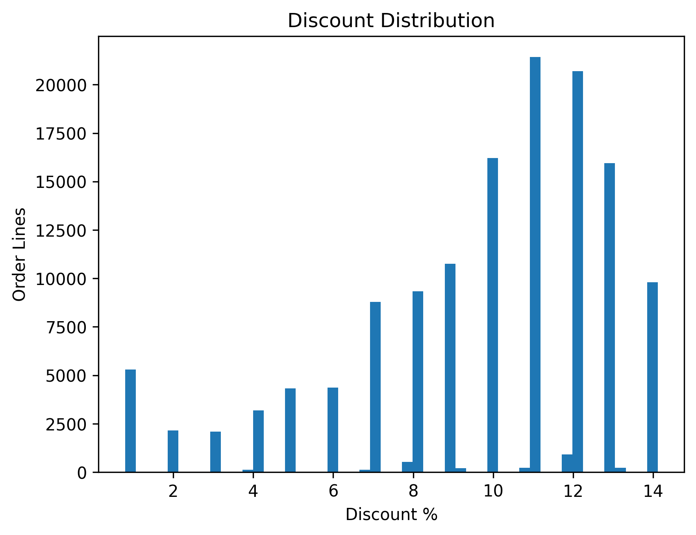
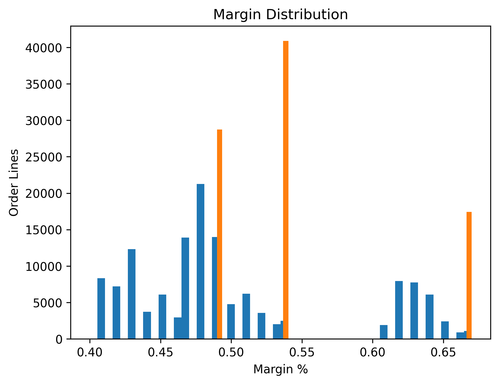
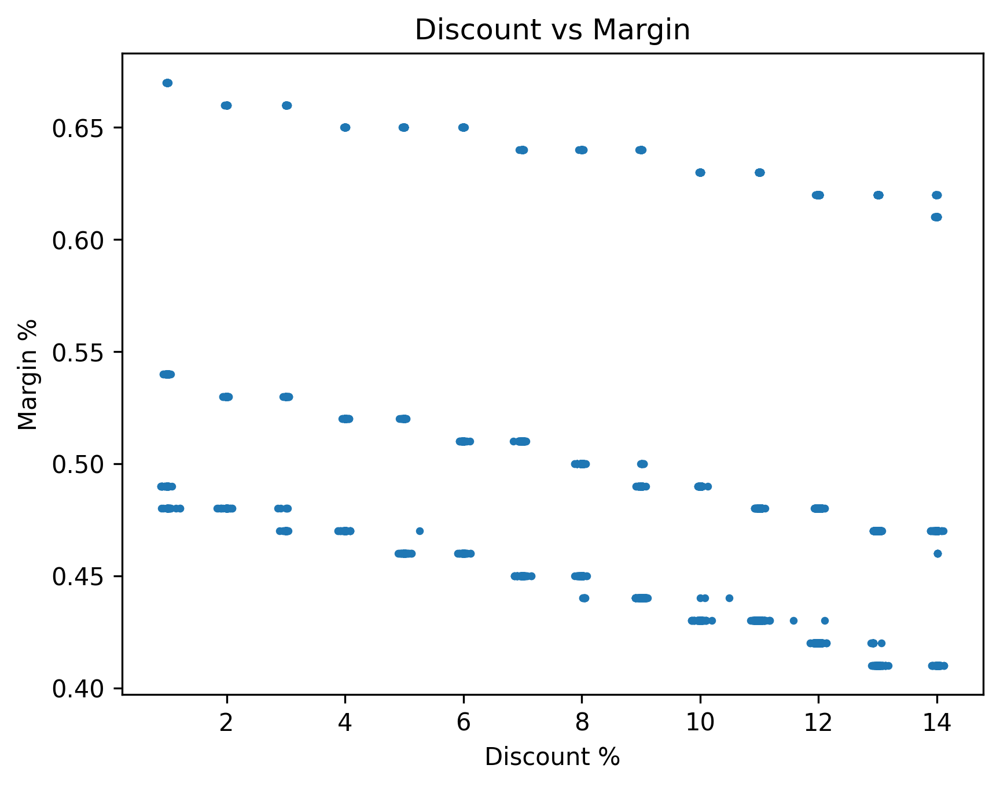
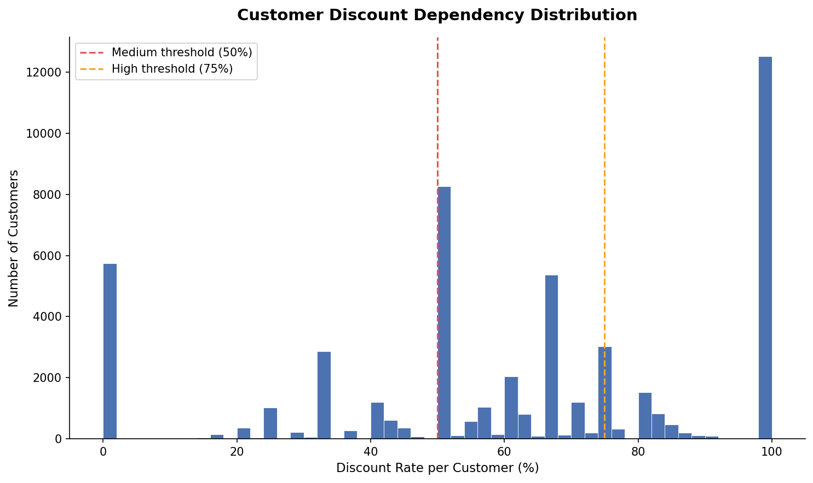
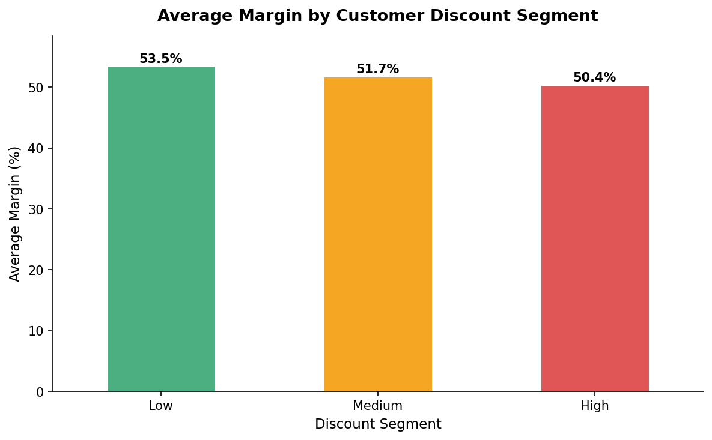
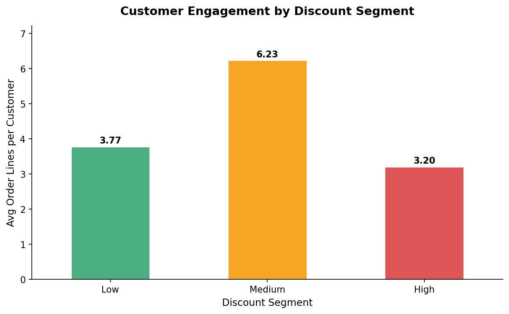
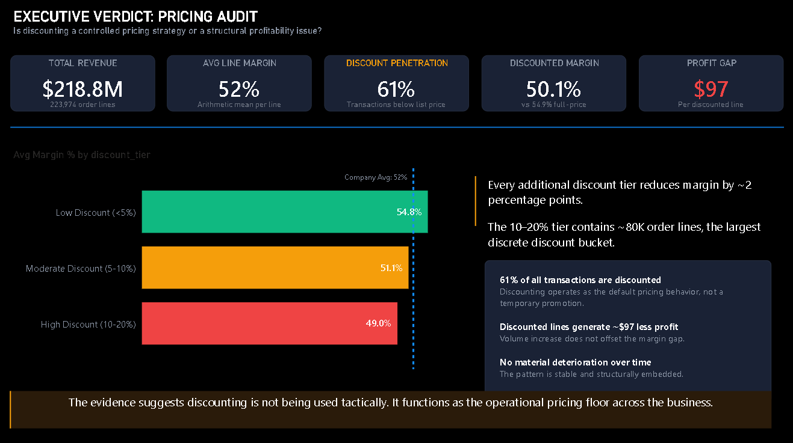
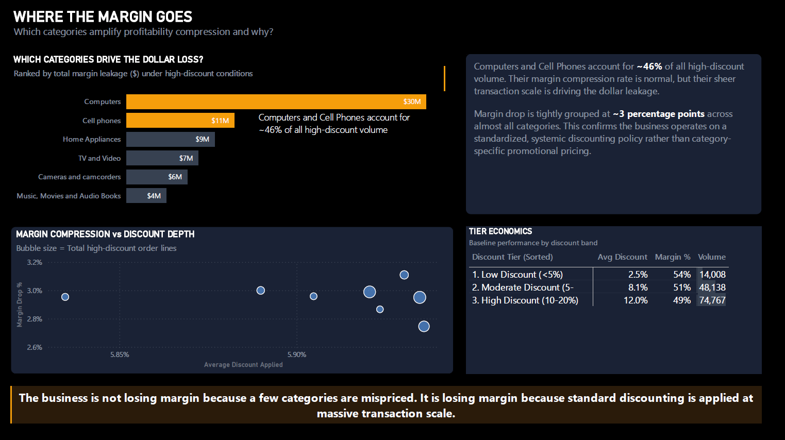
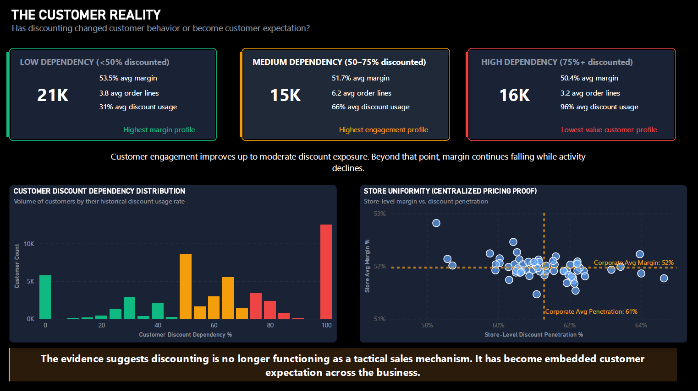
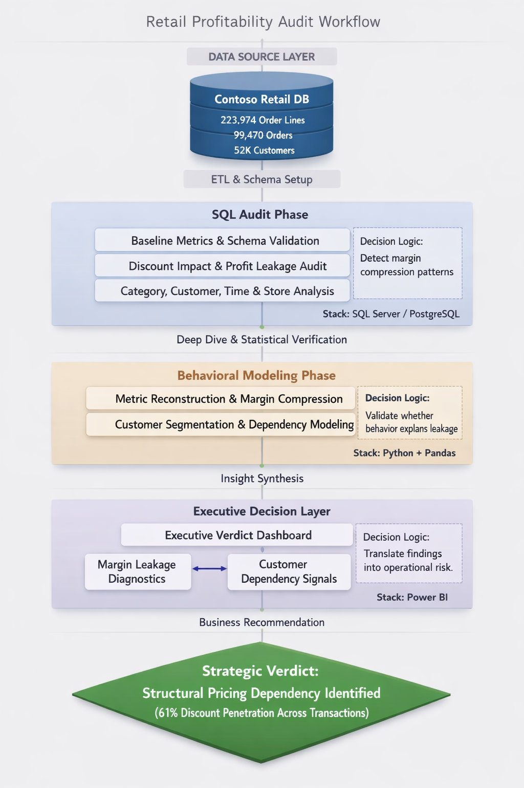

# Retail Discounting — Profitability Audit
**Full analysis:** See `docs/final_summary.md`

End-to-end pricing profitability audit evaluating whether discounting functions as a tactical pricing lever or a structural source of margin compression.

---

## Problem Statement

Discounting is one of the most common levers in retail pricing, but its impact on profitability is rarely measured with precision. This project investigates:

- How prevalent discounting is across transactions, categories, customers, and stores
- Whether discount depth correlates with margin compression
- Whether the pattern is stable or worsening over time

Understanding this matters because volume-driven discounting can mask profitability problems that are invisible at the aggregate revenue level.

---

## Executive Conclusion

The analysis indicates that discounting is no longer functioning as a tactical pricing lever.

Instead, it operates as the company’s structural pricing floor:

- 61% of all transactions occur below listed price
- margin declines consistently as discount depth increases
- high-discount customers generate the lowest profitability
- store behavior is nearly identical across locations
- the pattern remains stable year over year

The evidence suggests the business is not experiencing isolated promotional leakage. It is operating under a standardized discounting model that compresses margin at scale.

## Technical Stack

| Layer | Tools |
|---|---|
| Database | PostgreSQL |
| Analysis | SQL, Python (Pandas, Matplotlib) |
| Visualization | Power BI |
| Storage | Parquet |
| Version Control | Git + GitHub |

## Project Scope

**Current phase: Complete — SQL, Python, and Power BI dashboard all finished**

| Phase | Status |
|---|---|
| SQL analysis (exploration, discount impact, customer & store behavior, trends) | Complete |
| Python analysis (data validation, category analysis, customer segmentation) | Notebooks 1–2 Complete |
| Dashboard (Power BI) | Complete — 3 pages |
| Final reporting | Partially complete |

---

## Dataset Overview

**Source:** Contoso Retail (synthetic dataset)

**Grain:** Order line level — each row is a single product within a single order

**Scale:** ~223,000 order lines across ~93,000 orders

**Tables used:**

| Table | Role |
|---|---|
| `orderrows` | Primary transaction grain — prices, costs, quantities |
| `orders` | Order header — date, store, customer linkage |
| `customer` | Customer dimension |
| `product` | Product and category dimension |
| `store` | Store location and status |
| `date_dim` | Time dimension for trend analysis |
| `currency_exchange` | Present in schema; not applied in this phase |

---

## Business Questions Answered

1. Is discounting reducing profitability?
2. Which categories amplify margin leakage?
3. Are high-discount customers commercially valuable?
4. Is discounting tactical or structurally embedded?
5. Are stores behaving independently or under centralized pricing policy?
6. Is the pattern stable or deteriorating over time?

## Analytical Approach

The SQL analysis follows a structured sequence. Each file addresses a distinct business question.

- Establish scale and financial baseline across all transactions
- Measure the margin and profit efficiency gap between discounted and full-price transactions
- Segment discounted transactions by discount depth tier and measure margin compression at each level
- Identify which product categories drive the highest volume of high-discount transactions and the greatest margin impact
- Profile customer discount dependency and link it to average margin by segment
- Examine store-level discount behavior to determine whether pricing is centrally governed or location-driven
- Validate discount rate and margin trends year over year

---

## Key Findings

- ~61% of all order lines are transacted below the listed unit price, indicating discounting operates as a default pricing condition rather than a limited promotional tactic.
- Discounted transactions generate ~4 percentage points lower margin and ~$97 lower profit per order line versus full-price transactions.
- Margin compresses consistently as discount depth increases, falling from ~54% at low discount levels to ~49% within the 10–20% tier.
- Computers and Cell Phones contribute ~46% of all high-discount transaction volume and drive the largest aggregate margin leakage due to scale.
- Discount rates and margin levels remain highly uniform across stores, confirming centrally governed pricing behavior rather than local store discretion.
- No material deterioration is observed year-over-year, indicating the pricing pattern is stable and structurally embedded.
- High-discount customers generate the lowest margins while also exhibiting lower engagement than medium-dependency customers.
- 24.2% of customers transact at ≥90% discount dependency, while only 11% purchase near full price, confirming discounting has become normalized customer behavior rather than selective targeting.

---

## Additional Analytical Findings

- Correlation between discount depth and margin is -0.37, confirming a moderate but systematic inverse relationship.
- Margin compression remains highly consistent across categories (~4.9–5.3 percentage points), indicating standardized discounting rather than category-specific pricing optimization.
- Estimated margin loss is volume-driven rather than severity-driven: Computers and Cell Phones create the largest aggregate impact because of transaction scale.
- Customer-level margin declines monotonically across dependency segments:
  - Low Dependency: ~53.5%
  - Medium Dependency: ~51.7%
  - High Dependency: ~50.4%
- Medium-dependency customers demonstrate the highest engagement profile at 6.23 average order lines per customer.
- High-discount customers are the least commercially efficient segment: lower margins without proportional activity recovery.
- The customer engagement pattern follows an inverted-U structure, suggesting discounting supports engagement only up to a threshold before diminishing returns emerge.

## Visualizations

The following charts were produced during the Python validation phase. Full-resolution versions are available in `exports/`.

**Discount Depth Distribution**

Discount depth is tightly concentrated between 5% and 14%, confirming that the business operates within a controlled discounting band with no extreme price reductions.

**Margin Distribution — Discounted vs. Full-Price**

Discounted transactions cluster at a visibly lower margin level, reinforcing the ~4–5 percentage point compression identified in SQL.

**Discount Depth vs. Margin (Transaction-Level Scatter)**

The negative relationship between discount depth and margin is monotonic — no tier shows margin recovery — confirming that deeper discounts consistently erode profitability without exception.

**Customer Discount Dependency Distribution**

The distribution is right-skewed with the dominant concentration at 100%, confirming that the largest single customer group transacts almost exclusively on discounted prices. A secondary cluster near 50% reflects mixed purchasing behaviour.

**Average Margin by Customer Discount Segment**

Margin declines monotonically across the three segments — Low: 53.5%, Medium: 51.7%, High: 50.4% — confirming at the customer level that discount dependency is directly associated with lower realised profitability.

**Customer Engagement by Discount Segment**

Medium-discount customers generate the highest average order lines (6.23), nearly double the High-discount group (3.20). This inverted-U pattern confirms that beyond a threshold, additional discount dependency reduces engagement rather than increasing it.

## Executive Dashboard (Power BI)

The project now includes an executive-facing Power BI dashboard designed as a pricing audit rather than a generic BI report.

### Dashboard Philosophy

The dashboard is intentionally structured around one business question:

> Is discounting being used tactically, or has it become the operational pricing floor?

The design prioritises:
- executive readability within seconds
- decision-oriented visuals instead of exploratory clutter
- narrative clarity over interaction-heavy reporting

### Dashboard Structure (3 Pages)

**Page 1 — Executive Verdict: Pricing Audit**
KPI strip covering total revenue, average margin, discount penetration, and profit gap. 
Margin compression by discount tier with company average reference line. Structured 
insight panels and a final executive verdict banner answering the audit question directly.

**Page 2 — Where the Margin Goes**
Category-level margin leakage ranked by dollar impact. Bubble scatter showing margin 
compression vs discount depth by category. Tier economics table summarising baseline 
performance by discount band. Confirms margin erosion is volume-driven, not caused by 
extreme discounting in specific categories.

**Page 3 — The Customer Reality**
Three segment cards (Low, Medium, High dependency) showing customer count, average 
margin, average order lines, and average discount usage per segment. Customer discount dependency distribution histogram. Store uniformity scatter proving pricing is centrally governed, not store-driven. Closes the audit by confirming discounting has become embedded customer expectation rather than a tactical sales mechanism.

## Dashboard Preview

### Executive Verdict Dashboard
Identifies discounting as a structurally embedded pricing mechanism through KPI-driven executive audit visuals.



---

### Margin Leakage Diagnostics
Demonstrates how category-scale transaction volume amplifies profitability compression across standardized discount structures.



---

### Customer Dependency Analysis
Validates that discounting has become normalized customer purchasing behavior rather than selective promotional activity.



---

### Analytical Workflow & Validation Architecture
Illustrates the end-to-end audit framework connecting SQL validation, Python behavioral modeling, and Power BI executive reporting.



## Repository Structure

```
retail-discount-profitability-audit/
│
├── data/
│   ├── raw/          # Source CSV files (excluded via .gitignore)
│   └── processed/    # Cleaned or transformed outputs (pending)
│
├── docs/
│   ├── decisions_log.md        # Analytical decisions and justifications made during the project
│   ├── final_summary.md        # Full business-ready audit report
│   └── final_summary.pdf       # PDF export of the audit report
│
├── exports/          # Analytical chart exports
│
├── powerbi/          # Executive pricing audit dashboard (.pbix + assets)
│   ├── exports/      # Dashboard screenshots and analytical outputs
│       ├── dashboard_page_1.png
│       ├── dashboard_page_2.png
│       └── dashboard_page_3.png
│       └── kpi_cards_page_3.png
├── python/           # Validation, category analysis, customer segmentation, export preparation
│
├── sql/
│   ├── 00_schema.sql                    # Table definitions
│   ├── 01_load.sql                      # Data loading
│   ├── 02_exploration.sql               # Scale and financial baseline
│   ├── 03_discount_impact.sql           # Discounted vs. non-discounted performance
│   ├── 04_profit_leakage.sql            # Margin compression by discount tier
│   ├── 05_discount_drivers.sql          # Category-level discount volume and impact
│   ├── 06_customer_discount_behavior.sql # Customer segmentation by discount dependency
│   ├── 07_discount_trend_over_time.sql  # Year-over-year trend analysis
│   └── 08_store_discount_behavior.sql   # Store-level discount and margin comparison
│
├── .gitignore
└── README.md
```

---

## What This Project Demonstrates

- Business-oriented SQL analysis
- Translation of findings into executive reporting
- Customer segmentation and behavioral analysis
- validation using Python
- Decision-focused dashboard design
- Structured analytical documentation

## How to Reproduce

**Requirements:** PostgreSQL (tested on v18.3)

1. Create a database and run `00_schema.sql` to set up all tables
2. Place raw CSV files in `data/raw/` and update file paths in `01_load.sql` to match your local directory
3. Run `01_load.sql` to load all source data
4. Run SQL files `02` through `08` in order — each file is self-contained and includes its business question, query, and inline findings

No external dependencies are required for the SQL phase.

---

## Limitations

- **Synthetic data.** The Contoso dataset does not represent a real business. Findings reflect patterns in the data as structured and should not be interpreted as real-world conclusions.
- **Currency normalization not applied.** The analysis uses monetary values as-is. Since the focus is on relative metrics (margin %, discount rates), the impact is limited but not eliminated for absolute comparisons across geographies.
- **Line-level margin only.** Margin is computed as `(NetPrice - UnitCost) / NetPrice` per order line. Fixed costs, returns, and overheads are excluded.
- **No elasticity data.** It is not possible from this dataset to determine whether discounting generates incremental volume or simply applies a price reduction to demand that already existed.
- **Discount tiers are analytically defined.** Tier boundaries (5%, 10%, 20%) are set for pattern detection, not derived from internal pricing policy.

---

## Next Steps

- **Executive Summary** — One-page PDF distilling the audit findings and recommendations for non-technical stakeholders
- **Final Recommendations** — Evidence-backed recommendations with explicit failure 
  conditions and business constraints documented
- **Loom Walkthrough** — Recorded dashboard narrative for portfolio and outreach use
- **Medium Case Study** — Written case study framing the audit as a business problem, 
  not a technical exercise